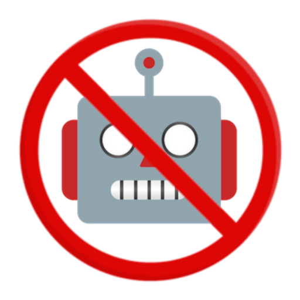

<p align="center">
  
    <h3 align="center">llmblocker</h3>
</p>

It is too easy to fall into the "productivity" trap and it's too easy to [wait 15 seconds](https://addons.mozilla.org/en-US/firefox/addon/leechblock-ng/) and then proceed to fall for it again.

How do we deal with this?


## Pi-hole
If you're running a pihole, add [`pihole-list`](pihole-list.txt) to your block list. PR if you find a new, untracked LLM. The extension automatically polls this list to determine which sites to block.

## Firefox
Pi-holes are not as wide-spread as the browser! Install the extension and challenge yourself to not disable it :).


## "Syntax"

```
## google.com/among/us/sus
```
This will block this specific url (only on the extension)

```
||google.com^
```
This will block all subdomains of google.com (both on the extension and pihole)

```
google.com
```
Currently only works on pihole.

## "How to add a new LLM"
1. Find the URL of the LLM you want to block.
2. Fork this repo and add the URL to the `pihole-list.txt` file.
3. Create a pull request with your changes.

>[!NOTE] 
>This is a community-driven project, so feel free to contribute by adding new LLMs/Gen AI to the list.


